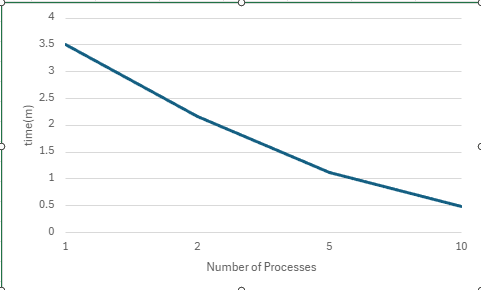

# System Programming Lab 11 Multiprocessing

## Brief overview of the Multiprocessing lab 
This lab's premise was to make a movie in the .mpg format from 50 .jpg images, created by multiple child processes. The more processes we have, the faster the file executes. This program uses "fork()" to create a child process and run the file mandel.c. 
Each of these children, which is user declared by the input-p, or uses the default if not provided, creates exactly one frame and then exits the program using the exit(1) command. The parent is in charge of actively keeping track of all the children and waiting for each of them, so we do not break the code. 
To compile this file, Dr. Turney provided a very convenient, neat Makefile. 

## Discussion of Runtime Results

This graph provided above clearly illustrates how the more processes we have -> the quicker our program actually is. For example, 1 process took roughly 3 minutes and 51 seconds, likewise 10 processes show a much faster result with a compile time of 48 seconds, which is much more efficient however more intensive on our computer. 
